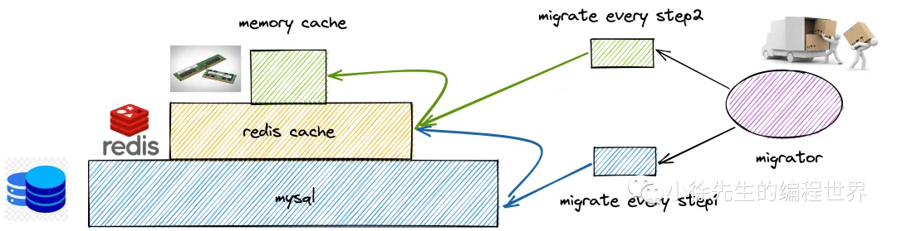

# 基于协程池架构实现分布式定时器 XTimer

## 1 背景

笔者 2021-2022 年期间工作部门为工效部研发协同效率中心，面向公司内各研发团队提供研效规则实施服务，规则灵活自由，`大量规则涉及定时定点或周期执行.`

## 3 核心思路

- 纵向分治: 按照时间(分钟)分桶，**桶内是一个有序容器**

- 横向分治: 根据任务id映射到不同的桶

## 4 服务架构

1. 总架构
   1. 定时任务调度流程
      3 个模块 + 2 个协程池
      调度器模块（Scheduler module）、触发器模块（Trigger module）和执行器模块（Executor module）三个模块
      各模块之间存在依赖关系，父模块通过**协程池**的方式异步启动子模块进行工作：
      
   2. 定时任务创建流程
      定时任务创建与 webServer 和 migrator 2 个模块有关
      
      xTimer 提供了 webServer 模块，面向用户提供 api 用于定时器的创建；
      用户激活定时器后，会根据定时器 cron 表达式批量创建定时任务，用于执行；
      此外，迁移器模块（migrator module）会定期将 db 中的定时任务提前加载的 redis 中，采用 zset 有序表进行组织，供触发器模块轮询触发.
2. 调度器模块
   负责二维分片(分时+分桶)的全局统筹分配.
3. 触发器模块
   按时唤醒二维分片内的定时任务
   
   在调度器模块中，`只能保证到 at least once 的语义`. 这是因为实际上没有手段能实现百分之百的分布式事务，
   即无法保证 （1）触发器完成时间分片作业 + （2）延长分布式锁过期时间 这两个动作整体具有原子性
4. 执行器模块
   真正执行定时任务.
   需要幂等去重，bloomFilter+mysql
   接收到的每一笔定时任务可以通过其`定时器 id 和执行时间`戳拼接出一个全局唯一的标识 id，简称为 定时任务 id
   
5. migrator 模块

   - 只用redis的话
     把 redis 这种基于内存实现的存储组件当作数据库使用，其数据可靠性在一定程度上存在风险.
     此外，定时任务无论执行时间远近均添加到 Redis 中，可能导致缓存迟迟得不到释放，造成资源浪费.
   - 三级存储模型 + 迁移器模块
     因此, xTimer 中基于 `mysql 数据库 + redis 缓存 + 节点内存` 建立三级存储模型，
     并增设一个迁移器模块(migrator module)根据任务执行时机由远及近进行存储介质之间的迁移同步.
     

   - 异步复制带来的数据一致性问题
     由于同一份数据可能分别位于 mysql 和节点内存中，如何保证数据一致性？
     定时器定义数据会发生变更的内容只有定时器状态（激活<->未激活）.可以通过和用户方约定，保证当调整定时器状态时，
     `可能存在一定滞后，但承诺状态最晚会在一个二级时间步的时长内完成同步，来规避这一问题.`
   - 批量打点 + 标记删除 + 定期清理

6. webServer 模块
   xTimer 中提供 webServer 模块，提供了一组 restful api 用于支持用户对定时器的 crud 操作.

## 5 讨论项 & 待优化项

1. 自适应的分桶参数：
   在 xTimer 的实现中，会通过集群的`资源情况`以及不同时间范围下`定时任务的数量规模`，实现对分桶数量的动态扩缩调整
